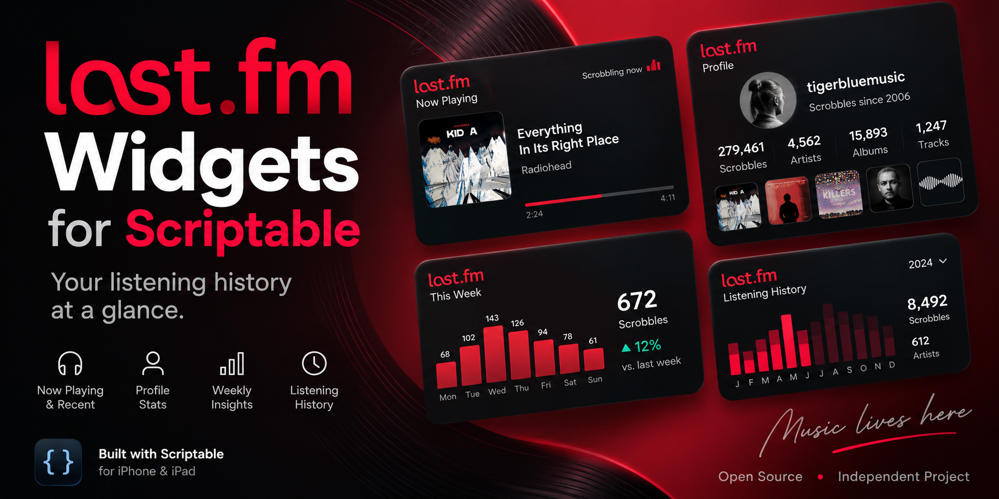
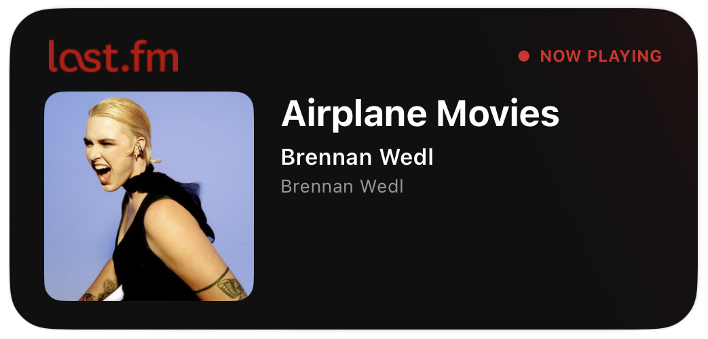
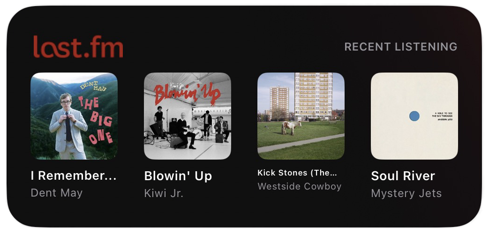
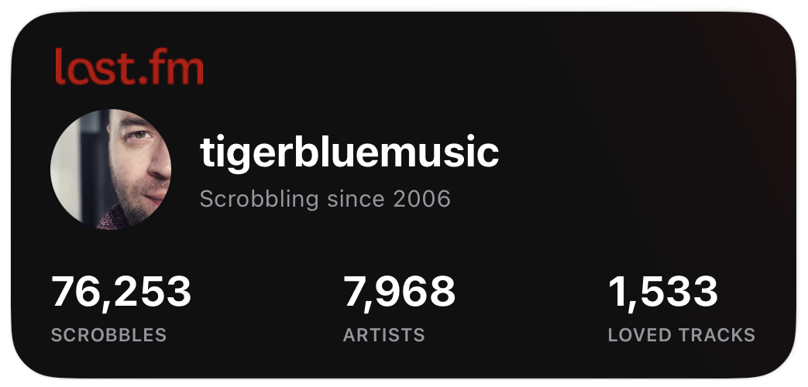
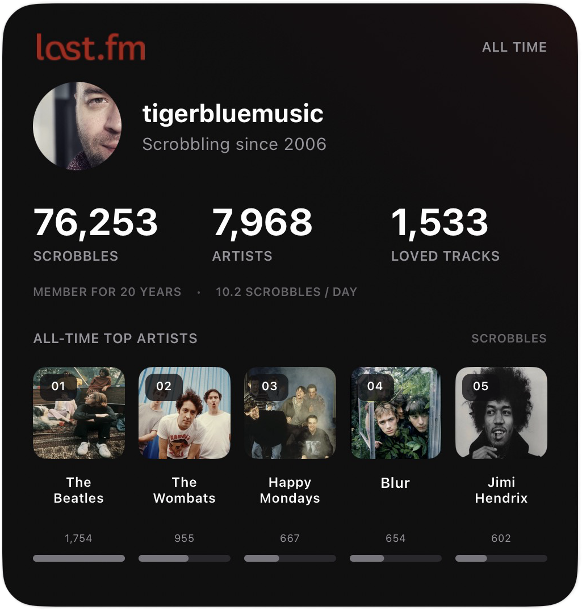
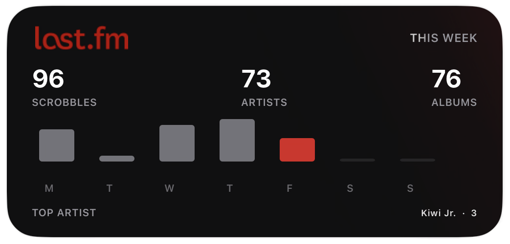
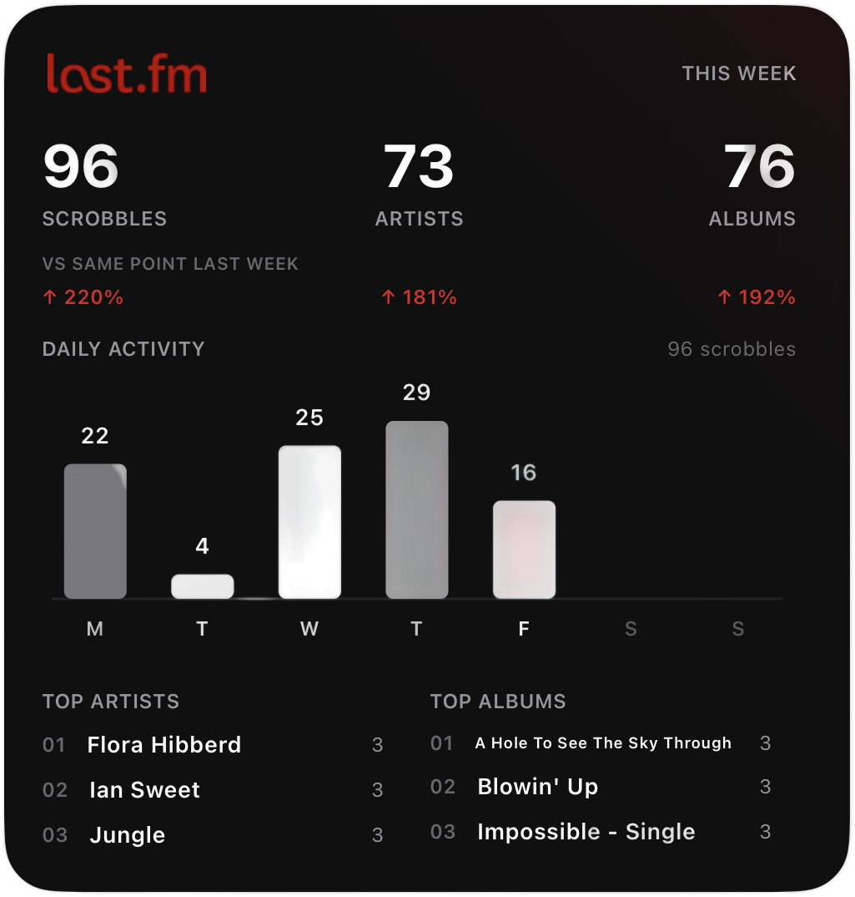
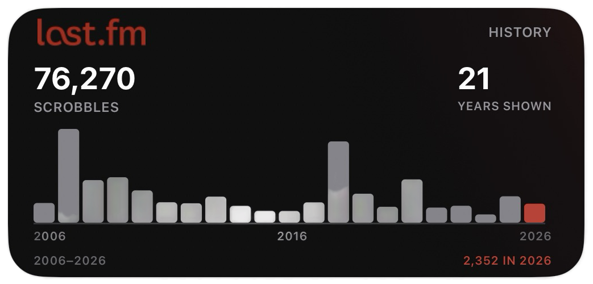
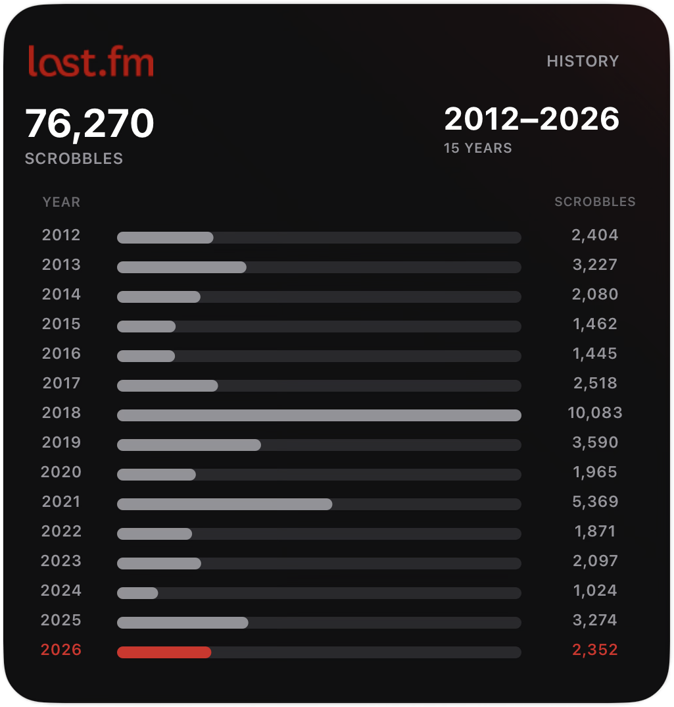

<p align="center">
  
</p>

# Last.fm Widgets for Scriptable

A collection of Home Screen widgets for iPhone and iPad that turn [Last.fm](https://www.last.fm) listening data into compact, at-a-glance views.

They are built for [Scriptable](https://scriptable.app) and the [Last.fm API](https://www.last.fm/api). The suite shares one visual language: dark backgrounds, Last.fm red accents, compact typography, and album or artist artwork where it helps. Several widgets cache data locally so they can still render if Last.fm is briefly unavailable.

> Independent, unofficial project. Not affiliated with, endorsed by, or associated with Last.fm.

## 🎧 Listening

<table>
  <tr>
    <td align="center" valign="top" width="50%">
      
      <p>
        <strong>Listening — Medium</strong><br>
        
        
      </p>
      <p>Shows the track Last.fm currently reports as now playing. If nothing is scrobbling, it shows the most recent listen instead — with album artwork, title, artist, album, a loved-track heart when relevant, and relative last-played time.</p>
      <p><a href="widgets/listening/Lastfm%20Listening%20Widget%20M.js"><code>widgets/listening/Lastfm Listening Widget M.js</code></a></p>
    </td>
    <td align="center" valign="top" width="50%">
      
      <p>
        <strong>Recent Listening — Medium</strong><br>
        
        
      </p>
      <p>A snapshot of four recent unique listens. Each column shows artwork, track title, and artist. Items without usable album artwork are skipped so the widget stays visual.</p>
      <p><a href="widgets/listening/Lastfm%20Recently%20Listen%20Widget%20M.js"><code>widgets/listening/Lastfm Recently Listen Widget M.js</code></a></p>
    </td>
  </tr>
</table>

## 👤 Profile

<table>
  <tr>
    <td align="center" valign="top" width="50%">
      
      <p>
        <strong>Profile — Medium</strong><br>
        
        
      </p>
      <p>An at-a-glance Last.fm profile: avatar, username, the year you started scrobbling, and lifetime totals for scrobbles, artists, and loved tracks.</p>
      <p><a href="widgets/profile/Lastfm%20Profile%20Widget%20M.js"><code>widgets/profile/Lastfm Profile Widget M.js</code></a></p>
    </td>
    <td align="center" valign="top" width="50%">
      
      <p>
        <strong>Profile — Large</strong><br>
        
        
      </p>
      <p>The expanded all-time profile. It adds membership duration and average scrobbles per day, then lists the five most-scrobbled artists with artwork, play counts, and proportional ranking bars.</p>
      <p><a href="widgets/profile/Lastfm%20Profile%20Widget%20L.js"><code>widgets/profile/Lastfm Profile Widget L.js</code></a></p>
    </td>
  </tr>
</table>

## 📊 This Week

<table>
  <tr>
    <td align="center" valign="top" width="50%">
      
      <p>
        <strong>This Week — Medium</strong><br>
        
        
      </p>
      <p>This calendar week, Monday through Sunday: scrobble total, unique artists, unique albums, a daily activity chart, and the week’s top artist.</p>
      <p><a href="widgets/insights/Lastfm%20Week%20Listen%20Widget%20M.js"><code>widgets/insights/Lastfm Week Listen Widget M.js</code></a></p>
    </td>
    <td align="center" valign="top" width="50%">
      
      <p>
        <strong>This Week — Large</strong><br>
        
        
      </p>
      <p>A fuller weekly dashboard: current-week scrobbles, artists, and albums; comparison with the same point last week; Monday–Sunday activity; and the top three artists and albums.</p>
      <p><a href="widgets/insights/Lastfm%20This%20Week%20Widget%20L.js"><code>widgets/insights/Lastfm This Week Widget L.js</code></a></p>
    </td>
  </tr>
</table>

## 📅 Listening History

<table>
  <tr>
    <td align="center" valign="top" width="50%">
      
      <p>
        <strong>Listening History — Medium</strong><br>
        
        
      </p>
      <p>Lifetime scrobbles across the full available account history, drawn as an annual chart. The current year is highlighted. Completed years are cached permanently; the current year is refreshed.</p>
      <p><a href="widgets/history/Lastfm%20Yearly%20Widget%20M.js"><code>widgets/history/Lastfm Yearly Widget M.js</code></a></p>
    </td>
    <td align="center" valign="top" width="50%">
      
      <p>
        <strong>Listening History — Large</strong><br>
        
        
      </p>
      <p>Fifteen years at a time, with exact annual totals and proportional bars. The current year is highlighted in Last.fm red. Place two instances with different Widget Parameters to cover more of the history.</p>
      <p><a href="widgets/history/Lastfm%20Yearly%20Widget%20L.js"><code>widgets/history/Lastfm Yearly Widget L.js</code></a></p>
    </td>
  </tr>
</table>

## 🧪 In Development

### Music by Decade — Large


**Script:** [`widgets/experimental/Lastfm Decade Widget L.js`](widgets/experimental/Lastfm%20Decade%20Widget%20L.js)

This is not a finished Home Screen widget. The current script is a development collector: it investigates Last.fm annual listening-report data, fetching at most one year per run and storing the results for later work on a decade view.

Do not install it as a normal widget yet.

### Genre Insights

A genre-focused widget is planned. There is no public script for it yet.

## Installation

Filenames ending in **M** are Medium widgets. Filenames ending in **L** are Large widgets.

1. Install [Scriptable](https://apps.apple.com/app/scriptable/id1405459188) from the App Store.
2. Create a Last.fm API account and obtain your own API key from [Last.fm](https://www.last.fm/api/account/create).
3. Choose a widget from this repository.
4. Open the `.js` file and download or copy it into Scriptable.
5. Edit the `CONFIG` section near the top:

   ```javascript
   username: "YOUR_LASTFM_USERNAME",
   apiKey: "YOUR_LASTFM_API_KEY"
   ```

6. Run the script once inside Scriptable. That confirms the credentials and, for some widgets, starts a local cache.
7. On the iPhone or iPad Home Screen, add a **Scriptable** widget.
8. Long-press the widget and choose **Edit Widget**.
9. Select the script you installed, then choose the matching size (Medium or Large).
10. If the widget supports it, set the **Widget Parameter** (see below).

Scriptable and iOS WidgetKit decide when Home Screen widgets actually refresh. Requested intervals in the scripts are not guaranteed exact schedules.

## Configuration

Each widget needs your own Last.fm username and API key. The copies in this repository use placeholders, not the maintainer’s account.

```javascript
const CONFIG = {
  username: "YOUR_LASTFM_USERNAME",
  apiKey: "YOUR_LASTFM_API_KEY",
  // ...
}
```

Obtain credentials from your own Last.fm API account. If you publish or fork a configured copy, replace personal values with placeholders first.

## Widget Parameters

Most widgets need no Widget Parameter. **Listening History — Large** is the exception.

| Parameter | Widget | Meaning |
| --- | --- | --- |
| `latest` | Listening History — Large | Latest 15 calendar years. This is the default. Example: 2012–2026. |
| `older` | Listening History — Large | Previous 15-year page. Example: 2006–2020. `old` and `1` also work. |

Add the Large History widget twice and give each instance a different parameter to see both periods. The two pages overlap when the account history is shorter than 30 years.

## Requirements

- iPhone or iPad
- [Scriptable](https://scriptable.app)
- A Last.fm account
- A Last.fm API key
- An internet connection for live Last.fm data

## Repository Structure

```text
assets/
  README-banner.png
  screenshots/
    lastfm-listening-widget-m.png
    lastfm-recently-listen-widget-m.png
    lastfm-profile-widget-m.png
    lastfm-profile-widget-l.png
    lastfm-week-listen-widget-m.png
    lastfm-week-listen-widget-l.png
    lastfm-yearly-widget-m.png
    lastfm-yearly-widget-l.png
widgets/
  listening/
    Lastfm Listening Widget M.js
    Lastfm Recently Listen Widget M.js
  profile/
    Lastfm Profile Widget M.js
    Lastfm Profile Widget L.js
  insights/
    Lastfm Week Listen Widget M.js
    Lastfm This Week Widget L.js
  history/
    Lastfm Yearly Widget M.js
    Lastfm Yearly Widget L.js
  experimental/
    Lastfm Decade Widget L.js
```

`assets` holds the banner and widget screenshots. `widgets` holds the Scriptable scripts.

## Disclaimer

Last.fm Widgets for Scriptable is an independent, unofficial project. It is not affiliated with or endorsed by Last.fm. The Last.fm name and logo belong to their respective owner.
